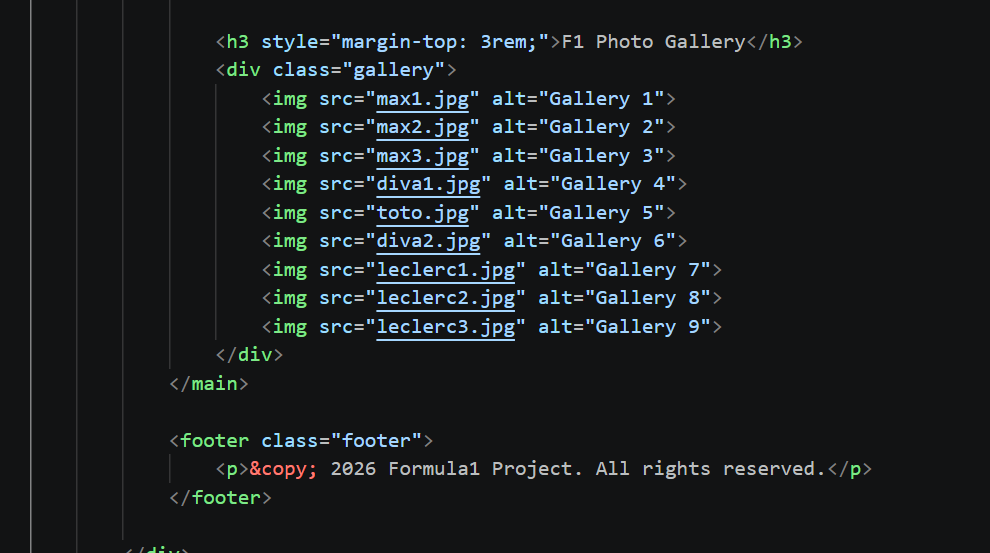
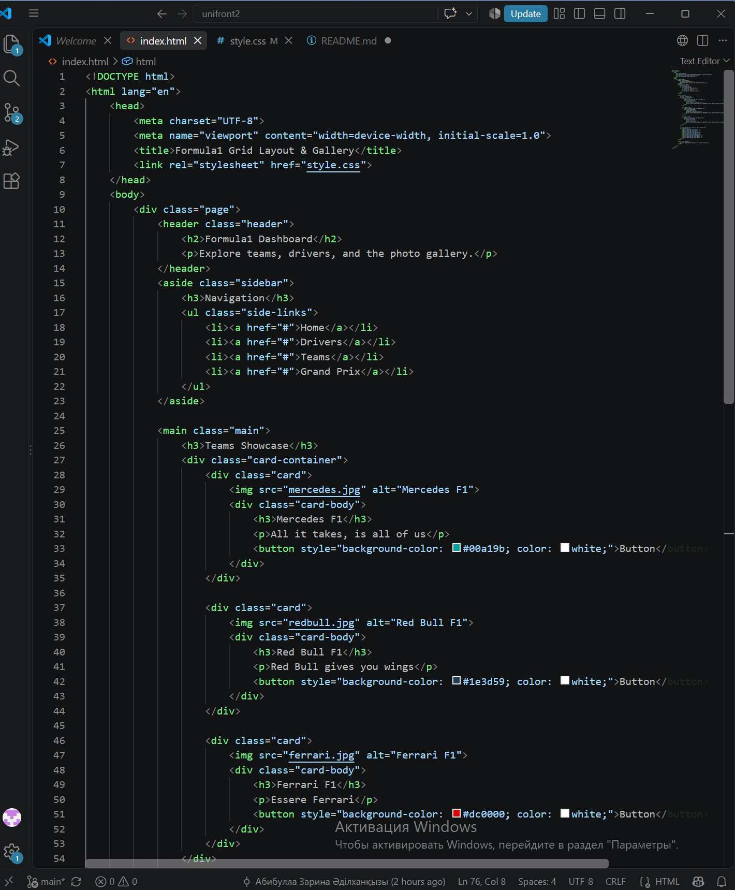
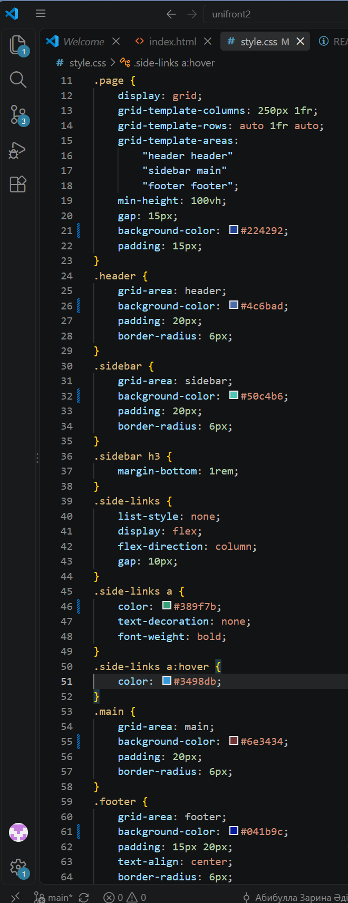
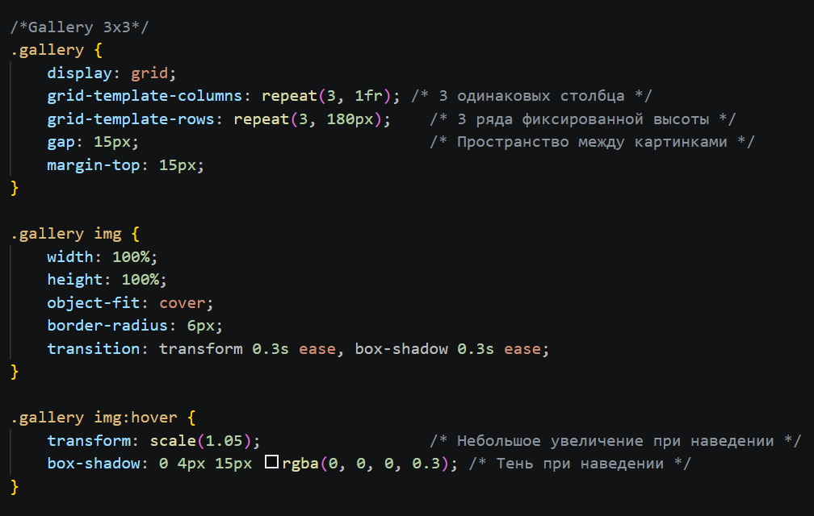
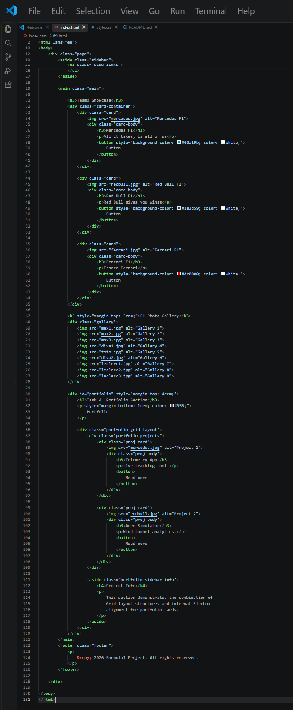
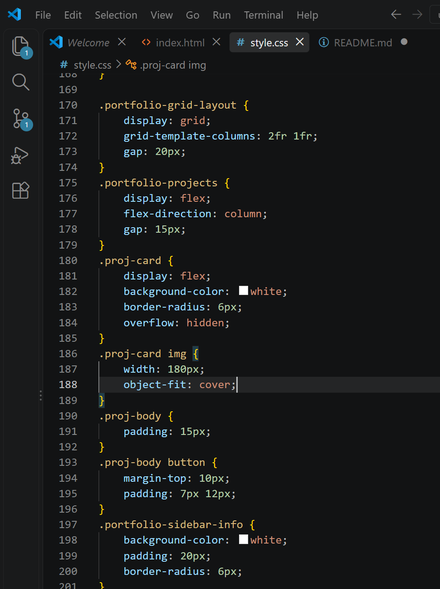
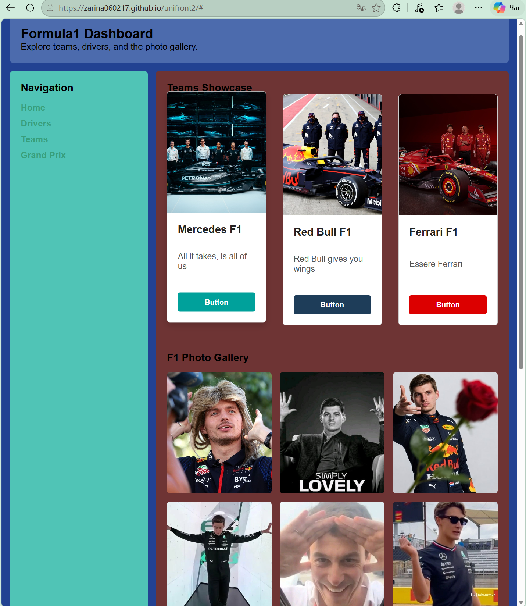
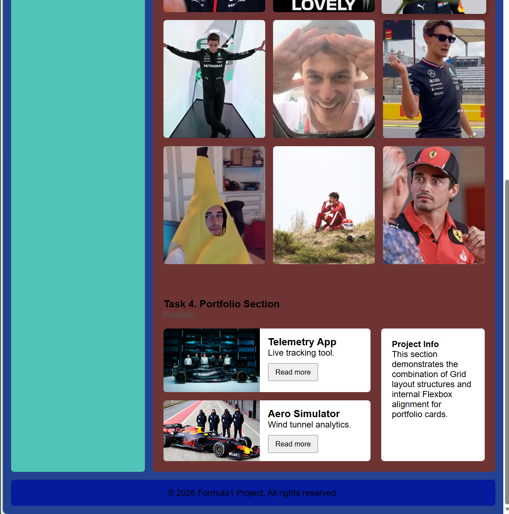

# unifront2
# Assignment #2: Advanced CSS (Flexbox & Grid)

* **Name:** Zarina Abibulla
* **Group:** IT-2501

* Setup and fisrt commit to new github repository.
* Task 0 
* 
* navigation container html
*
* navigation container css
* 
* Task 1
* 
* card row html
* 
* card row css
* 

* How we completed task :
* * display: flex → Puts the cards in a horizontal row instead of stacking them.

* * gap: 20px → Adds clean, even spacing between the cards.

* * align-items: stretch + flex: 1 → Makes all cards share the exact same height and width.

* * flex-grow: 1 on the text → Forces all the buttons to align neatly at the bottom of each card.

* * :hover effect → Lifts the card up (translateY) and adds a shadow when you mouse over it.
* Part2
* 
* html gallery
* 
* sidebar html
* 
* css of main parts within sidebar
* 
* gallery css
* 

* Task 2: Page Layout with Grid Areas

* * display: grid → Turns the parent container into a grid layout.

* * grid-template-columns & rows → Sets up the dimensions for the sidebar and main content sections.

* * grid-template-areas → Places the header on top, sidebar on the left, main content on the right, and footer at the bottom.

* Task 3: Image Gallery

* * display: grid → Turns the gallery container into a grid.

* * grid-template-columns: repeat(3, 1fr) → Creates three equal-width columns for the 3×3 layout.

* * gap: 15px → Adds clean, consistent spacing between all images.

* * :hover effect → Scales the image up slightly and adds a shadow when you mouse over it.
* Part3
* * 
* all with portfolio html
* 
* portfolio css
* 
* 
* For Task 4, we created a portfolio page with a header, main section, sidebar, and footer.
* * Page structure: HTML semantic elements such as <header>, <main>, <aside>, and <footer> were used to organize the page.
* * Flexbox navigation: Flexbox was used to arrange the navigation links in the header/sidebar and keep the elements aligned.
* * CSS Grid: CSS Grid was used in the portfolio section to place the Projects area on the left and the Project Info sidebar on the right.
* * Project cards: Flexbox was used inside the project cards to arrange the image, title, description, and button.
* * Footer: CSS Grid was used in the main page layout so the footer spans across the bottom of the page.
* * Spacing and alignment: Padding, margins, gaps, and consistent sizing were added to keep the sections and cards neatly aligned.
* Website: https://zarina060217.github.io/unifront2/#