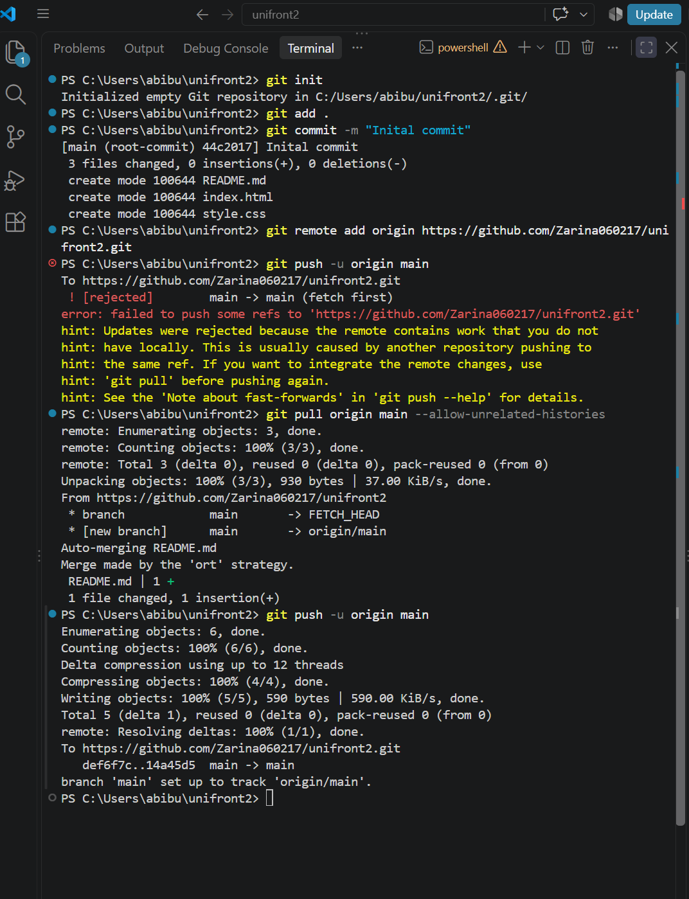
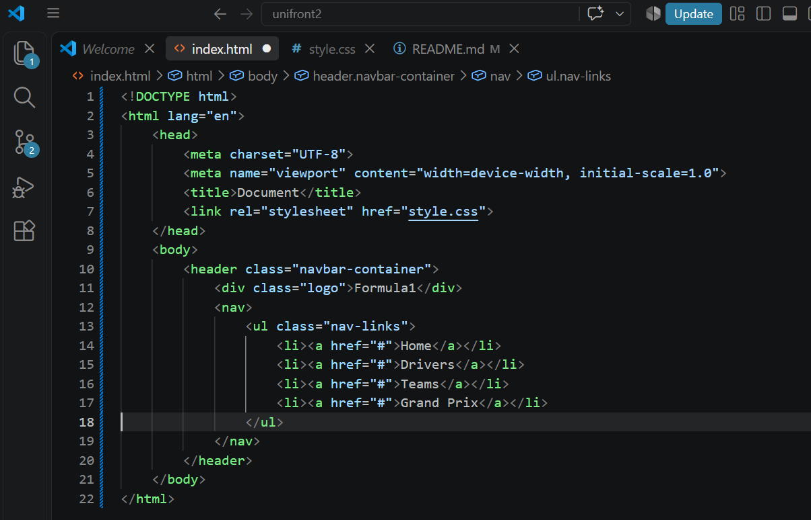
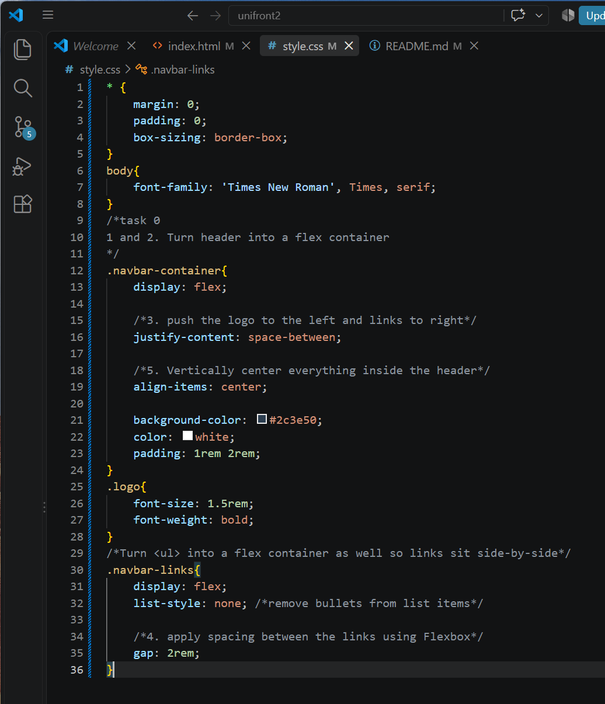
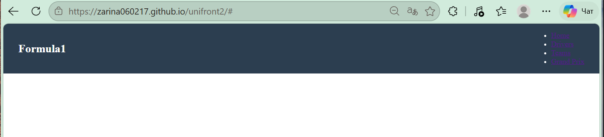
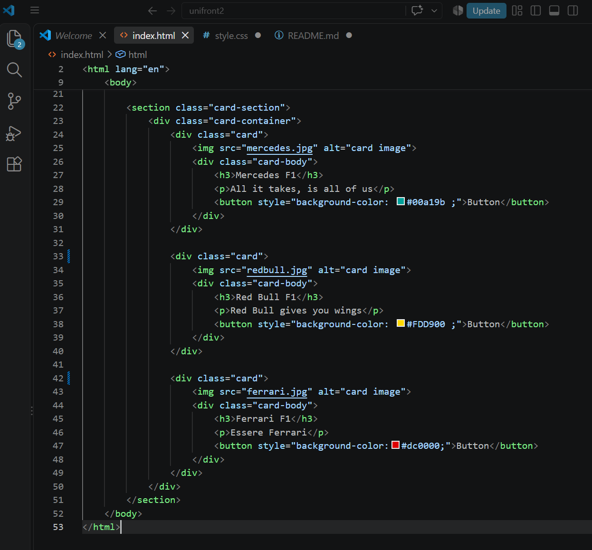
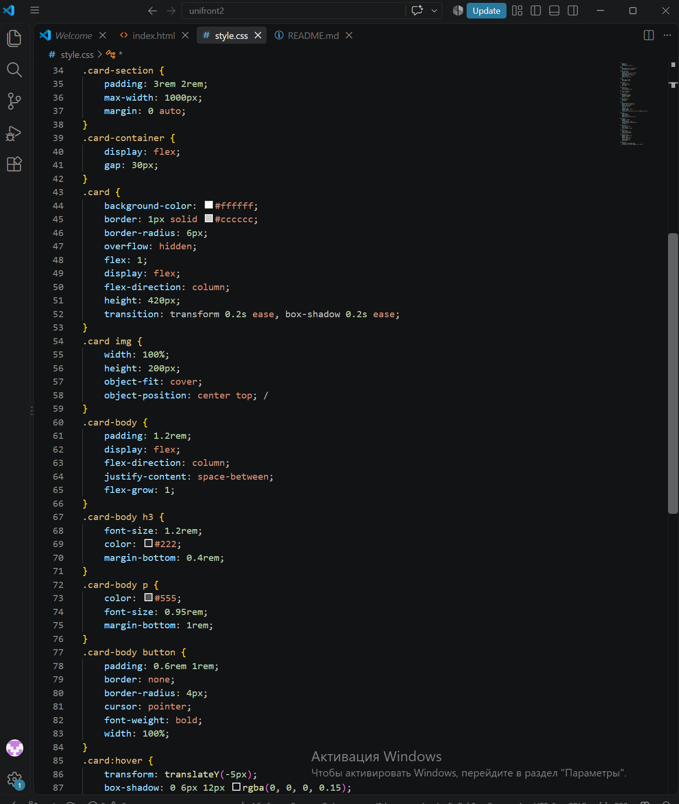
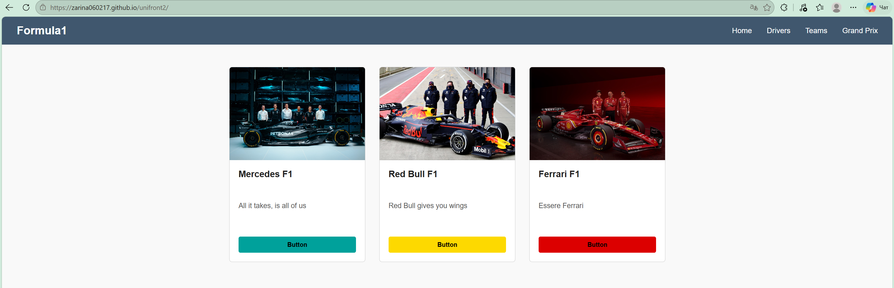

# unifront2
# Assignment #2: Advanced CSS (Flexbox & Grid)

* **Name:** Zarina Abibulla
* **Group:** IT-2501

* Setup and fisrt commit to new github repository.
* Task 0 
* 
* navigation container html
*
* navigation container css
* 
* Task 1
* 
* card row html
* 
* card row css
* 

* How we completed task :
* * display: flex → Puts the cards in a horizontal row instead of stacking them.

* * gap: 20px → Adds clean, even spacing between the cards.

* * align-items: stretch + flex: 1 → Makes all cards share the exact same height and width.

* * flex-grow: 1 on the text → Forces all the buttons to align neatly at the bottom of each card.

* * :hover effect → Lifts the card up (translateY) and adds a shadow when you mouse over it.